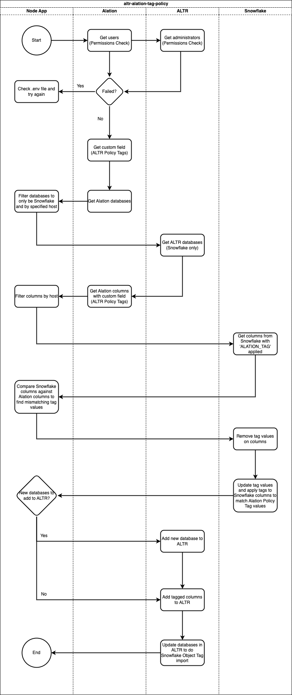

# ALTR + Alation Tag Policy Integration

The ALTR + Alation Tag Policy integration is a tool to pass policy tags in Alation to Snowflake and ALTR.

The tool grabs tags of each column from a custom field in Alation, applies those tag values to the corresponding column in Snowflake, imports Snowflake Object Tags into ALTR and adds said columns to ALTR to be governed.

This tool is plumbing between two available API's:

* [ALTR Management API](https://altrnet.live.altr.com/api/swagger/)

* [Alation API](https://developer.alation.com/dev/reference/refresh-access-token-overview)

and Snowflake.

## How it works

The tool:

01. Gets columns from Alation that have 'ALTR Policy Tag' applied
02. Gets columns from Snowflake that have 'ALATION_TAG' applied
03. If the Snowflake column and Alation column tag values do not match it un-sets the tag in Snowflake and updates it with the correct tag values to match Alation 'ALTR Policy Tag'
04. For any new column that's tagged in Alation, it sets the same tag in snowflake and adds the column to ALTR to be governed
05. For any database in ALTR that contained a column that had a tag change, it updates the database to pull tag changes
06. For any column in Alation/Snowflake that had a tag change and does not belong to an ALTR database, it adds said database to ALTR

## Why use it

<a  href="https://www.altr.com/">ALTR</a> partnered with <a  href="https://www.alation.com/">Alation</a> to fill a gap between data cataloging and data governance. 

With this powerful tool, you can apply tags to columns in Alation and automatically have those tags applied to the corresponding Snowflake columns. If ALTR is already applying policy on those tags, the new columns will automatically have the same policies applied via ALTR. If not, you can easily create a tag-based policy in ALTR on that new tag.

## Visuals

Integration Flowchart:

## Installation

**Install From Source**

	$ git clone https://github.com/altrsoftware/altr-alation-tag-policy.git
	
	$ cd altr-alation-tag-policy

**Install npm packages**

    $ npm install

## Before using the tool  

**1. Fill out the .env file environment variables**

	// ALATION
	ALATION_API_ACCESS_TOKEN = "Your Alation API Access Token"
	ALATION_DOMAIN = "Your Alation domain (example-prod.alationcatalog.com)"
	ALATION_EMAIL = "The email used to sign in and create the API Access Token"
	
	// SNOWFLAKE
	SF_ACCOUNT = "Snowflake account identifier (exampleorg.us-east-1)"
	SF_DB_USERNAME = "Your Snowflake username that has admin rights AND must have ALTR service role granted (PC_ALTR_ROLE or ALTR_SERVICE_ROLE)"
	SF_DB_PASSWORD = "Your Snowflake password"

	SF_HOSTNAME = "The hostname of your Snowflake instance (example.us-west-3.snowflakecomputing.com)"
	SF_WAREHOUSE = "Default warehouse your ALTR service role uses"
	SF_ROLE = "If you connected to ALTR through Snowflake Partner Connect (PC_ALTR_ROLE) | If you created a ALTR service user (ALTR_SERVICE_ROLE)"
	
	//ALTR
	ALTR_DOMAIN = "Your ALTR domain (altrnet.live.altr.com)"
	ALTR_KEY_NAME = "Your ALTR Management API key name"
	ALTR_KEY_PASSWORD = "Your ALTR Management API key password"

**2. Grant Role to Snowflake User**
	
	GRANT ROLE <PC_ALTR_ROLE | ALTR_SERVICE_ROLE> TO USER <SF_DB_USERNAME>; 

* The Snowflake user (SF_DB_USERNAME) you put in .env variables file must have the role of PC_ALTR_ROLE or ALTR_SERVICE_ROLE granted to it depending if you connected to ALTR using Snowflake Partner Connect or created your own ALTR Service User.

**3. You must add a custom field to your Alation environment for this application to work successfully**

	$ node createCustomField.js --domain=<Alation Domain> --account=<Alation Login Email> --password=<Alation Login Password>

01. Click the *Settings* icon at the top right of your Alation environment

02. In the *Catalog Admin* section, click *Customize Catalog*

03. Click the *Custom Templates* tab

04. Under the *Data Object Templates* section, click *Column*

05. On the right side of the template, click *Insert* -> *Custom Field* -> *ALTR Policy Tags*

06. At the top of the template, click *Save*

> Note: You can add more / any tags by going to *Customize Catalog* and editing options in *ALTR Policy Tags* custom field

**4. Please consider the Snowflake Object Tags named 'ALATION_TAG' created and used by this integration as 'sacred'. If you manually alter/delete these tags in Snowflake it could cause problems when using the integration.**

## How To Use

> **Warning:** 
> You must complete the **Before using the tool** section; otherwise, the integration will not work correctly.

**Method 1: <a  href="https://www.docker.com/">Docker</a>**

This method will install the necessary packages needed to run the application for you.

	$ docker build -t altr/altr-alation-tag-policy .
	
	$ docker run -d altr/altr-alation-tag-policy

**Method 2: Manually**

	$ npm install

	$ node index.js

## Dependencies

This application was built using the following node packages and their respected version:

* [axios](https://www.npmjs.com/package/axios/v/0.27.2) : 0.27.2

* [axios-cookiejar-support](https://www.npmjs.com/package/axios-cookiejar-support/v/4.0.3) : 4.0.3

* [axios-mock-adapter](https://www.npmjs.com/package/axios-mock-adapter/v/1.21.2) : 1.21.2

* [dotenv](https://www.npmjs.com/package/dotenv/v/16.0.3) : 16.0.3

* [jest](https://www.npmjs.com/package/jest/v/29.2.2) : 29.2.2
  
* [node](https://nodejs.org/download/release/v16.0.0/) : 0.27.2

* [snowflake-promise](https://www.npmjs.com/package/snowflake-promise/v/4.5.0) : 4.5.0

* [tough-cookie](https://www.npmjs.com/package/tough-cookie/v/4.1.2) : 4.1.2

* [yargs](https://www.npmjs.com/package/yargs/v/17.6.2) : 17.6.2

  

## Support

Need support to get this application running? Have questions, concerns or comments?

Email *application-engineers@altr.com* with a subject line of "ALTR + Alation Tags Policy Integration".
   
  

## License

[GNU General Public License](LICENSE.md)
